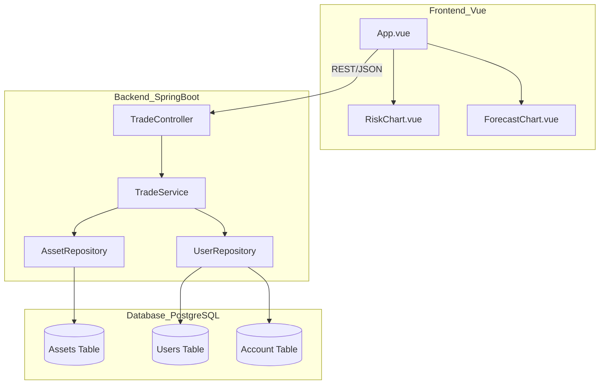

# 💹 FinTrail Simulator

**FinTrail Simulator** is a full-stack investment sandbox. It features a real-time Market Terminal, a 7-day stochastic price forecast, and a risk distribution dashboard.

## 🏗 Architecture & Design Patterns

### GRASP Compliance
The system is designed with **High Cohesion** and **Low Coupling**:
* **Information Expert**: The `TradeService` acts as the expert for business logic, handling balance validations and asset acquisition.
* **Controller**: The `TradeController` manages system events (REST requests) without bloating business logic, delegating execution to services.
* **Creator**: The JPA Repository layer handles the creation and persistence of entities based on relational mapping.

### ER Mapping (Entity-Relationship)
The project utilizes a relational schema with strictly enforced constraints:
* **One-to-One**: A `User` is linked to a single `VirtualAccount`.
* **Many-to-One**: Multiple `Asset` records are managed by the system, which users can interact with via transactions.

### System Architecture (Mermaid)


---

## 📦 Getting Started

### 1. Database Setup (Docker)
```bash
docker exec -it fintrail-db psql -U adityashankar -d fintrail
```

### 2. Backend (Spring Boot)
- Open `backend` in IntelliJ and run `FintrailSimulatorApplication`.
- Port: 8080

### 3. Frontend (Vue.js)
```bash
cd frontend
npm install
npm run dev
```
- Port: 5173

---
*Developed as a Full-Stack Design-Pattern-Centric Portfolio Piece.*
