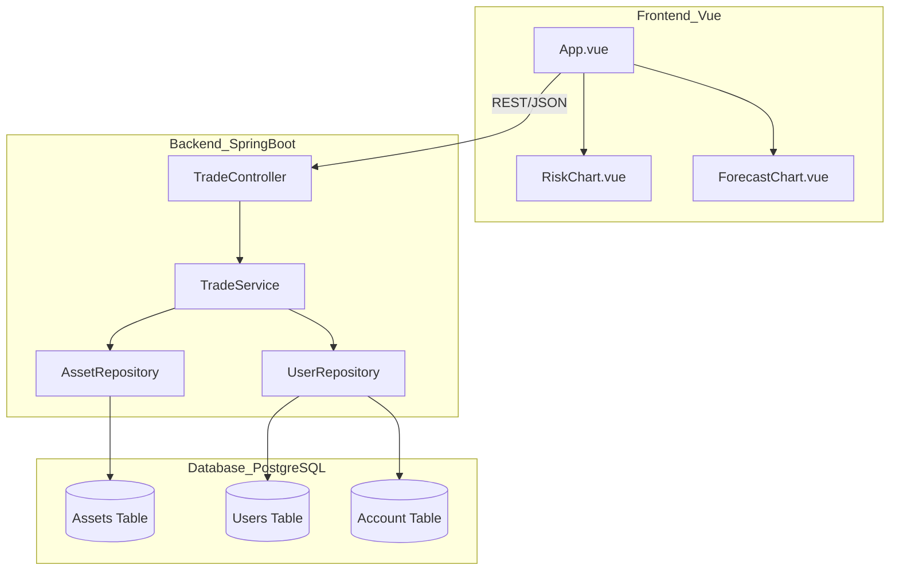

# 💹 FinTrail Simulator

**FinTrail Simulator** is a full-stack investment sandbox. It features a real-time Market Terminal, a 7-day stochastic price forecast, and a risk distribution dashboard.

## 🏗 Architecture & Design Patterns

### GRASP Compliance
The system is designed with **High Cohesion** and **Low Coupling**:
* **Information Expert**: The `TradeService` handles business logic, validating balances and asset acquisition.
* **Controller**: The `TradeController` manages REST requests, delegating execution to services.
* **Creator**: The JPA Repository layer handles persistence of entities.

### System Architecture


---

## 📦 Getting Started

### 1. Database Setup (Docker)
```bash
docker exec -it fintrail-db psql -U adityashankar -d fintrail
```

### 2. Backend (Spring Boot)
- Open `backend` in IntelliJ and run `FintrailSimulatorApplication`.
- Port: 8080

### 3. Frontend (Vue.js)
```bash
cd frontend
npm install
npm run dev
```
- Port: 5173

## 🐳 Quick Start with Docker Compose
To start the entire ecosystem (DB, Backend, Frontend) at once:
```bash
docker-compose up --build
```

---
*Developed as a Full-Stack Design-Pattern-Centric Portfolio Piece.*
